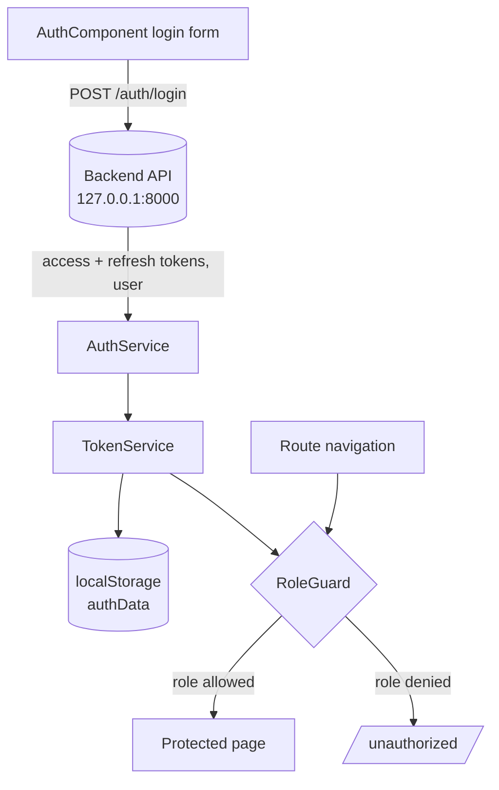

<div align="center">

# Angular Auth Starter

**An Angular 19 starter for JWT login and role-based access control, with standalone components and server-side rendering.**


</div>

> [!NOTE]
> **Project status: early-stage starter.** This is a frontend client. It expects a
> backend that serves a `POST /auth/login` endpoint (set to `http://127.0.0.1:8000`
> by default). The login flow, token storage, and role guard work today. The user
> and admin areas are scaffolded but not fully wired up yet. See the [Roadmap](#roadmap).

## Table of Contents

- [About](#about)
- [Features](#features)
- [Tech Stack](#tech-stack)
- [Architecture](#architecture)
- [Getting Started](#getting-started)
- [Project Structure](#project-structure)
- [Configuration](#configuration)
- [Roadmap](#roadmap)
- [Contributing](#contributing)
- [License](#license)

## About

Angular Auth Starter is a small, modern base for apps that need sign-in and
role-based access. It signs a user in against a backend, stores the JWT access
and refresh tokens, and protects routes by role (ADMIN, USER, RIDER). It uses
Angular 19 standalone components and is set up for server-side rendering with
Express.

Use it as a starting point so you do not have to wire up auth and route guards
from scratch on every new Angular project.

## Features

- **JWT login.** A reactive login form posts credentials to the backend and
  receives access and refresh tokens.
- **Token storage.** A `TokenService` keeps the tokens and user data in
  `localStorage` behind one small, swappable layer.
- **Role-based guards.** A `RoleGuard` checks the user's role against the roles a
  route requires and redirects to an unauthorized page when they do not match.
- **Roles built in.** An `ERole` enum defines ADMIN, USER, RIDER, and a default
  guest role.
- **Logout.** Clears stored auth data and returns the user to the login page.
- **Server-side rendering.** An Express server entry point is included for SSR
  builds.

## Tech Stack

| Layer | Technology |
|-------|------------|
| Framework | Angular 19 (standalone components) |
| Language | TypeScript 5.6 |
| Reactivity | RxJS 7 |
| HTTP | Angular `HttpClient` |
| Forms | Angular Reactive Forms |
| Routing | Angular Router with a role guard |
| SSR | Angular SSR with Express |
| Testing | Karma and Jasmine |
| Styling | Plain CSS |

## Architecture

A login posts to the backend, the response tokens are stored, and the route guard
reads the stored role on every protected navigation.



## Getting Started

### Prerequisites

- **Node.js** 18.18 or newer
- **npm**
- A backend that serves `POST /auth/login` (see [Configuration](#configuration))

### Installation

```bash
# 1. Clone
git clone https://github.com/atiqbitstream/angular-auth-starter.git
cd angular-auth-starter

# 2. Install dependencies
npm install

# 3. Start the dev server
npm start
```

Then open **http://localhost:4200**.

### Available scripts

| Command | Description |
|---------|-------------|
| `npm start` | Start the dev server on port 4200 |
| `npm run build` | Production build to `dist/` |
| `npm run watch` | Rebuild on change (development configuration) |
| `npm test` | Run unit tests with Karma and Jasmine |
| `npm run serve:ssr:zakatFront` | Run the server-side-rendered build |

## Project Structure

```
src/app/
├── features/
│   ├── auth/         # Login component and AuthService
│   ├── home/         # Post-login home and HomeService
│   └── user/         # User area (scaffolded)
├── shared/
│   ├── services/     # TokenService
│   ├── guards/       # RoleGuard
│   └── enums/        # ERole (ADMIN, USER, RIDER, DEFAULT)
└── app.routes.ts     # Route definitions
```

## Configuration

The backend URL lives in `src/environments/environment.ts`:

```typescript
export const environment = {
  production: false,
  hackUrl: 'http://127.0.0.1:8000', // backend base URL
};
```

Point `hackUrl` at your backend. The app calls `POST {hackUrl}/auth/login` and
expects a response containing `accessToken`, `refreshToken`, and a `user` object.

## Roadmap

- [ ] Build out the user and admin pages and wire their routes
- [ ] Add an HTTP interceptor to attach the access token to requests
- [ ] Add refresh-token rotation on expiry
- [ ] Show login errors in the UI instead of the console
- [ ] Add a production environment file
- [ ] Add unit tests for the services and guard

## Contributing

Contributions are welcome. Please open an issue to discuss larger changes first,
keep pull requests focused, and make sure the build passes before you submit.

## License

Released under the **MIT License**. See [LICENSE](LICENSE) for details.
